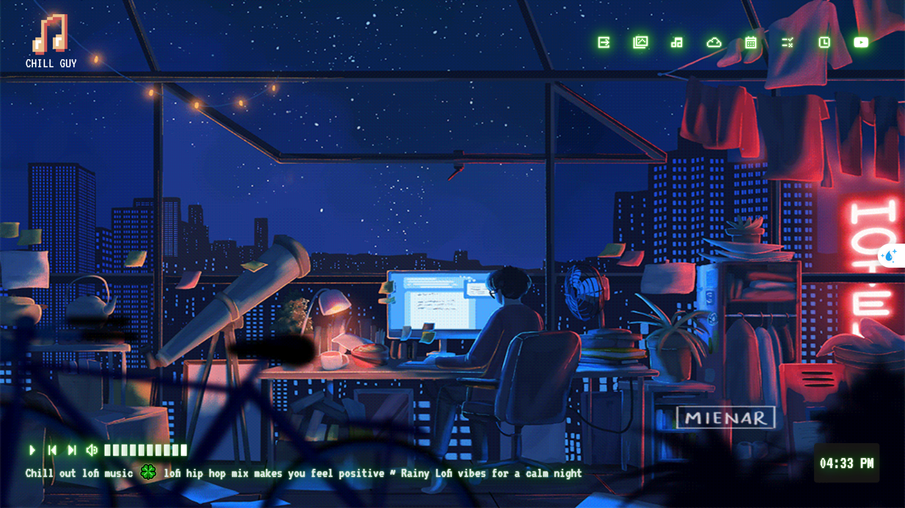
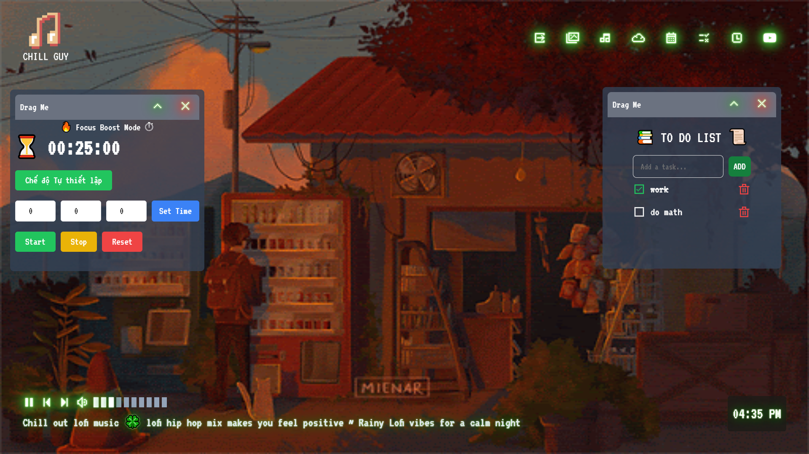

Chill-Guy 🎧

Chill-Guy là một ứng dụng web được thiết kế giúp bạn tập trung học tập, làm việc và quản lý thời gian hiệu quả. Với giao diện thân thiện và tính năng phong phú, Chill-Guy giúp bạn tạo không gian học tập lý tưởng.
🖼️ Giao diện  
Dưới đây là một số hình ảnh giao diện của ứng dụng:  

🌟 Tính năng nổi bật:
 - 🎵 Nghe nhạc nền giúp tập trung:
    Thư giãn hoặc tập trung với những bản nhạc nền phù hợp.
 - ✅ Quản lý danh sách công việc (To-Do List):
   Ghi chú và sắp xếp các nhiệm vụ trong ngày dễ dàng.
 - ⏳ Hẹn giờ học tập theo kỹ thuật Pomodoro:
   Tập trung học tập và nghỉ ngơi theo chu kỳ khoa học.
 
 🚀 Công nghệ sử dụng:
 - React: Thư viện JavaScript để xây dựng giao diện người dùng.
 - Vite: Công cụ phát triển nhanh với HMR (Hot Module Replacement).
 - Tailwind CSS: Tạo giao diện nhanh chóng với CSS utility-first.
 - Redux: Quản lý trạng thái toàn cục một cách hiệu quả.
 - React Player: Tích hợp trình phát nhạc mượt mà.

 Plugin phát triển:
Dự án sử dụng @vitejs/plugin-react để hỗ trợ Fast Refresh thông qua Babel.

💡 Định hướng phát triển
 - Thêm thư viện nhạc phong phú hơn.
 - Hỗ trợ tài khoản người dùng để lưu dữ liệu trực tuyến.
 - Cung cấp báo cáo hiệu quả học tập theo tuần/tháng.
Hãy trải nghiệm Chill-Guy để tối ưu hóa không gian học tập của bạn ngay hôm nay! 🎉
